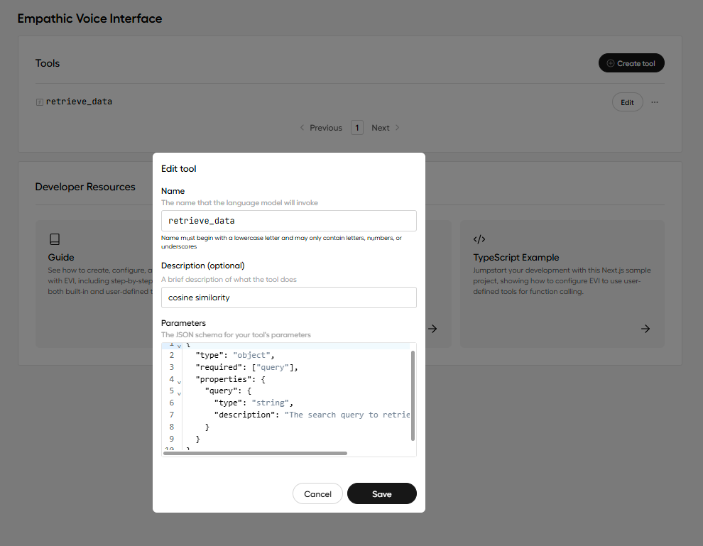

## Retrieval Augmented Generation(RAG) with Hume-AI

This project attempts to implement Retrieval Augmented Generation(RAG) with Function calling !!

**Checkout the complete code and live application for better understanding <a href="https://prana-client.vercel.app/" target="_blank">Live</a> <a href="https://github.com/iAdtya/prana_client" target="_blank">Github</a>**

### Packages

```javascript
npm i hume
npm i @humeai/voice-react
npm i openai
npm i unstructured-client
npm i @qdrant/js-client-rest
```

### Intialize Hume-AI

get access token and pass the token to VoiceProvider wrapper

```javascript
"use server";
import { fetchAccessToken } from "hume";

const HUME_SECRET_KEY = process.env.HUME_SECRET_KEY;
const HUME_API_KEY = process.env.HUME_API_KEY;

export default async function Page() {
  const accessToken = await fetchAccessToken({
    apiKey: HUME_API_KEY,
    secretKey: HUME_SECRET_KEY,
  });

  return <ClientComponent accessToken={accessToken} />;
}
```

### ClientComponent

VoiceProvider creates a socket connection between the application and Hume-AI
Wrapp the Front-end component like Chat-Box and start call button

```javascript
"use client";

import { VoiceProvider } from "@humeai/voice-react";
import { Cosine } from "../Cosine";

export default function ClientComponent({ accessToken }) {
  return (
    <VoiceProvider
      configId={process.env.NEXT_PUBLIC_HUME_CONFIG_ID}
      auth={{ type: "accessToken", value: accessToken }}
      onToolCall={handleToolCall}
    >
      <div>
        <Messages />
        <Call />
      </div>
    </VoiceProvider>
  );
}

const handleToolCall = async (message, socket) => {
  if (message.name === "retrieve_data") {
    try {
      const { query } = JSON.parse(message.parameters);

      const data = await Cosine({ userText: query });

      const toolResponseMessage = {
        type: "tool_response",
        toolCallId: message.toolCallId,
        content: data,
      };

      return socket.success(toolResponseMessage);
    } catch (error) {
      return socket.error({
        error: "Embeddings retrieval error",
        code: 400,
      });
    }
  }

  return socket.error({
    error: "Tool not found",
    code: 401,
  });
};
```

### Create Connection

This will create connection with the Hume-AI client with help of VoiceProvider wrapper

```javascript
"use client";

import { useVoice } from "@humeai/voice-react";

export function Call() {
  const { connect, disconnect, status } = useVoice();

  const handleClick = () => {
    if (status.value === "connected") {
      disconnect();
    } else {
      try {
        connect();
      } catch (error) {
        console.log("Error connecting:", error);
      }
    }
  };

  return (
    <div className="flex items-end justify-center">
      <button disabled={status.value === "connecting"} onClick={handleClick}>
        {status.value === "connected" ? "End Call" : "Start Call"}
      </button>
    </div>
  );
}
```

### Retrieve message content from the WS stream

Destructure the message content, role ... from the useVoice !!

```javascript
"use client";
import { useVoice } from "@humeai/voice-react";
import { useEffect, useRef } from "react";

export default function Messages() {
  const { messages } = useVoice();

  return (
    <div>
      {messages.length === 0 && (
        <p>Press Start Call to start the conversation With Prana-Bot!!</p>
      )}
      {messages.map((msg, index) => {
        if (msg.type !== "user_message" && msg.type !== "assistant_message")
          return null;

        const { role, content } = msg.message;
        return (
          <div
            key={msg.type + index}
            className={`mb-1 ${
              role === "assistant" ? "justify-start" : "justify-end"
            } flex`}
          >
            <div
              className={`chat-bubble max-w-[80%] break-words ${
                role === "assistant"
                  ? "bg-base-200 text-primary"
                  : "bg-primary text-white"
              }`}
            >
              {content}
            </div>
          </div>
        );
      })}
    </div>
  );
}
```

### Create Hume-Tool Caling with Schema

Remember the name of tool to be same in handleToolCall function in my case its "retrieve_data"



```json
{
  "type": "object",
  "required": ["query"],
  "properties": {
    "query": {
      "type": "string",
      "description": "The search query to retrieve podcast data."
    }
  }
}
```

### Qdrant-Vector Database

Initialize OpenAI QdrantClient to create embeddings and storing them in Qdrant DB

```javascript
"use server";

import { QdrantClient } from "@qdrant/js-client-rest";
import OpenAI from "openai";

const collection = "test";

const openai = new OpenAI({
  apiKey: process.env.OPENAI_API_KEY,
});

const client = new QdrantClient({
  url: process.env.QDRANT_URL,
  apiKey: process.env.QDRANT_API_KEY,
});

**Cosine-Similarity**

export async function Cosine(data) {
  try {
    const { userText } = data;

    const embeddingResponse = await openai.embeddings.create({
      model: "text-embedding-3-large",
      input: userText,
    });

    const queryEmbedding = embeddingResponse.data[0].embedding;
    const results = await client.search(collection, {
      vector: queryEmbedding,
      limit: 3,
    });

    const responseData = results.map(
      (obj, i) => `${(i + 1).toString()}. ${obj.payload.page_content}`
    );

    return responseData.join("\n\n");
  } catch (error) {
    return {
      error: "An error occurred during similarity search.",
    };
  }
}
```

### FileUpload

Parse the document and create Embeddings to Upsert them to Qdrant

```javascript
"use server";

import { promises as fs } from "fs";
import path from "path";
import { UnstructuredClient } from "unstructured-client";
import { Strategy } from "unstructured-client/sdk/models/shared/index.js";
import os from "os";
import { QdrantClient } from "@qdrant/js-client-rest";
import OpenAI from "openai";

const collectionName = "test";
const VECTOR_SIZE = 3072;

const unstructuredClient = new UnstructuredClient({
  security: {
    apiKeyAuth: "*******",
  },
});

export async function uploadFile(file) {
  try {
    await ensureCollectionExists();

    const uploadDir = path.join(
      // process.cwd(), "src", "app",
      os.tmpdir(),
      "uploads"
    );
    await fs.mkdir(uploadDir, { recursive: true });

    const filePath = path.join(uploadDir, file.name);
    await fs.writeFile(filePath, Buffer.from(await file.arrayBuffer()));

    const fileData = await fs.readFile(filePath);

    const response = await unstructuredClient.general.partition({
      partitionParameters: {
        files: {
          content: fileData,
          fileName: file.name,
        },
        strategy: Strategy.Auto,
      },
    });

    const points = [];

    for (const element of response.elements) {
      try {
        const embeddingResponse = await openai.embeddings.create({
          model: "text-embedding-3-large",
          input: element.text,
        });

        const embedding = embeddingResponse.data[0].embedding;

        points.push({
          id: crypto.randomUUID(),
          vector: embedding,
          payload: {
            content: element.text,
            metadata: {
              type: element.type,
              fileName: file.name,
            },
          },
        });
      } catch (error) {
        console.error("Error creating embedding:", error);
      }
    }

    return {
      success: true,
      filePath,
      message: `Successfully processed ${points.length} elements`,
    };
  } catch (error) {
    return {
      success: false,
      error: error.message,
    };
  }
}
```

### Handle File Upload on Frontend

```javascript
"use client";
import React, { useState } from "react";
import { uploadFile } from "../UploadFile";

export const File = () => {
  const [message, setMessage] = useState("");
  const [selectedFile, setSelectedFile] = useState(null);
  const [buttonText, setButtonText] = useState("Upload File");

  const handleFileChange = (event) => {
    const file = event.target.files[0];
    setSelectedFile(file);
  };

  const handleSubmit = async (event) => {
    event.preventDefault();
    if (selectedFile) {
      setButtonText("Processing...");
      try {
        const result = await uploadFile(selectedFile);
        if (result.success) {
          setMessage(`${result.filePath} - ${result.message}`);
          setButtonText("Upload File");
        } else {
          setMessage("File upload failed");
          setButtonText("Upload File");
        }
      } catch (error) {
        setMessage(`File upload failed: ${error.message}`);
        setButtonText("Upload File");
      }
    } else {
      setMessage("No file selected");
    }
  };

  return (
    <div>
      <form onSubmit={handleSubmit}>
        <input type="file" name="file" onChange={handleFileChange} />
        <button type="submit">{buttonText}</button>
        <p>{message}</p>
      </form>
    </div>
  );
};
```

### ENJOY
