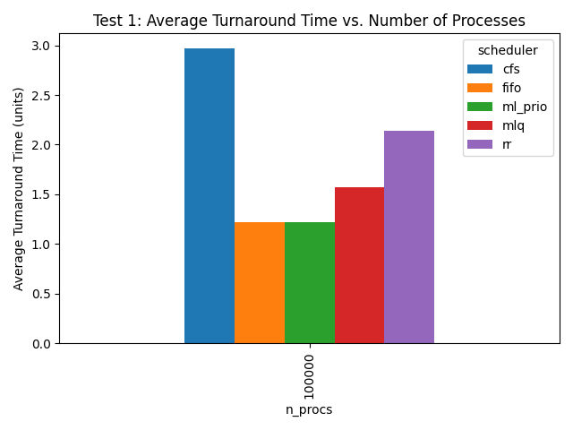

## CPU Scheduling with Deep Reinforcement Learning

This project develops a Deep Reinforcement Learning (DRL) model to optimize CPU scheduling, aiming to reduce turnaround time and outperform the traditional Round-Robin algorithm. The model uses Proximal Policy Optimization (PPO) to dynamically adjust task priorities for enhanced scheduling efficiency.

### PPO Architecture

#### Policy Network

- **Input**: Current state $s_t$
- **Output**: Action probabilities $pi(a_t / s_t)$

#### Value Network

- **Input**: Current state $s_t$ $a_t$
- **Output**: Value estimate $V(s_t)$

#### Data Store

- The agent processes the environment through the policy network, producing a probability distribution over actions.
- Selected **actions, states, rewards, and probabilities**, are stored in a data store for every batch.

---

## Future Rewards Calculation

Future rewards, also known as **Return-to-Go** are computed recursively as: $G*t = r_t + \gamma G*{t+1}$

This is implemented using the cumulative discounted reward formula:

```python
discounted_reward = rew + (discounted_reward * self.gamma)
```

**Expanded Formula**:
$G*t = r_t + \gamma r*{t+1} + \gamma^2 r\_{t+2} + \dots$

### Code Implementation

```python
def compute_rtgs(self, batch_rews):
    batch_rtgs = []
    for ep_rews in reversed(batch_rews):
        discounted_reward = 0
        for rew in reversed(ep_rews):
            discounted_reward = rew + (discounted_reward * self.gamma)
            batch_rtgs.insert(0, discounted_reward)
    return torch.tensor(batch_rtgs, dtype=torch.float)
```

---

## Advantage Function

The advantage function measures how much better an action $a_t$ is compared to the expected policy behavior: $A_t = G_t - V(s_t)$

- $G_t$: Future rewards, computed in the `compute_rtgs` method.
- $V(s_t)$: Value estimate obtained from the critic network.

### Advantage Calculation

Advantage is computed in the PPO `learn` method:

```python
# Calculate Advantage
A_k = batch_rtgs - V.detach()
```

- **`batch_rtgs`**: Precomputed future rewards using `compute_rtgs`.
- **`V.detach()`**: Ensures the critic network's gradients do not interfere with the calculation.

### Code Implementation

```python
# todo Generalized Advantage Estimation GAE is a method to estimate the advantage function, which represents how much better an action is compared to the average action in a given state
V, _ = self.evaluate(batch_obs, batch_acts)

def evaluate(self, batch_obs, batch_acts):
        # query critic network for value V for each obs in batch_obs after encoding
        # batch_obs = self.obs_enc(batch_obs)
        V = self.critic(batch_obs).squeeze()
        # print('eval', V.detach().shape)

        # get log probabilities
        mean = self.actor(batch_obs)
        dist = MultivariateNormal(mean, self.cov_mat)
        log_probs = dist.log_prob(batch_acts)
        return V, log_probs
```

---

## Clipped Surrogate Loss

The **clipped surrogate loss** ensures stable policy updates by constraining deviations from the previous policy.

### Key Components

**Probability Ratio $r_t(\theta)$**:
$$r*t(\theta) = \frac{\pi*\theta(a*t | s_t)}{\pi*{\theta\_{\text{old}}}(a_t | s_t)}$$

**Clipping Constraint**:
$$\text{clip}\left( r_t(\theta), 1-\epsilon, 1+\epsilon \right)$$

**Objective Function**:
$$\mathcal{L}^\text{CLIP} = \mathbb{E}\left[ \min\left(r_t(\theta) A_t, \text{clip}(r_t(\theta), 1-\epsilon, 1+\epsilon) A_t\right) \right]$$

---

## Policy Loss

The actor network uses the clipped surrogate loss for optimization:

```python
# Compute probability ratios
log_probs = self.actor(batch_obs).log_prob(batch_actions)
old_log_probs = batch_log_probs.detach()
ratios = torch.exp(log_probs - old_log_probs)

# Clipped surrogate loss
surr1 = ratios * batch_advantages
surr2 = torch.clamp(ratios, 1 - self.clip, 1 + self.clip) * batch_advantages
actor_loss = -torch.mean(torch.min(surr1, surr2))

# Backpropagate and optimize
self.actor_optimizer.zero_grad()
actor_loss.backward()
self.actor_optimizer.step()
```

### Explanation

**Log-Probabilities**:

- Current policy: $$\log \pi\_\theta(a_t | s_t)$$
- Old policy: $$\log \pi*{\theta*{\text{old}}}(a_t | s_t)$$

**Probability Ratios**:
$$r*t(\theta) = \exp(\log \pi*\theta - \log \pi*{\theta*{\text{old}}})$$

**Surrogate Objectives**:

- Original objective: $$r_t(\theta) A_t$$
- Clipped objective: $$\text{clip}(r_t(\theta), 1-\epsilon, 1+\epsilon) A_t$$

**Loss Minimization**:

- The minimum of these ensures stability during training:
  $$\text{Loss} = -\mathbb{E}\left[\min\left(r_t(\theta) A_t, \text{clip}(r_t(\theta), 1-\epsilon, 1+\epsilon) A_t\right)\right]$$

---

## Loss Optimization

The actor network updates using the calculated loss:

```python
self.actor_optimizer.zero_grad()
actor_loss.backward()
self.actor_optimizer.step()
```

The critic network is trained similarly, minimizing the squared error between $G_t$ and $V(s_t)$.

---

### Neural Network Architecture

The implementation uses a feed-forward neural network with the following structure:

```python
import torch
from torch import nn
import torch.nn.functional as F
import numpy as np

class FeedForwardNN(nn.Module):
    def __init__(self, in_dim, out_dim):
        super(FeedForwardNN, self).__init__()

        self.layer1 = nn.Linear(in_dim, 64)
        self.layer2 = nn.Linear(64, 64)
        self.layer3 = nn.Linear(64, out_dim)

    def forward(self, obs):
        if isinstance(obs, np.ndarray):
            obs = torch.tensor(obs, dtype=torch.float)

        # todo applies relu activation to the output of the layer
        activation1 = F.relu(self.layer1(obs))
        activation2 = F.relu(self.layer2(activation1))
        output = self.layer3(activation2)

        return output
```

### Custom Gym Environment (`PrioritySchedulerEnv`)

The custom environment models a **priority-based process scheduler** where processes are dynamically managed based on their **arrival time**, **instruction count**, and **assigned priority**. This environment provides structured data for PPO to learn effective scheduling strategies.

---

### Observation Space

The observation space is a **matrix** of shape `(encoder_context + 1, 5)`. It provides the agent with state information, including:

- **Current process**: $\text{PID}, \text{arrival time}, \text{total instructions}, \text{remaining instructions}$
- **Priority queue** state for the current scheduling context.

#### Code

```python
import gymnasium as gym
import numpy as np

class PrioritySchedulerEnv(gym.Env):
    def __init__(self, encoder_context=5, max_priority=10):
        super().__init__()
        self.encoder_context = encoder_context
        self.max_priority = max_priority

        # Observation space: (encoder_context + 1 processes, 5 features each)
        self.observation_space = gym.spaces.Box(
            low=0,
            high=np.inf,
            shape=(encoder_context + 1, 5),
            dtype=np.float32
        )

        # Action space: Assign priority levels (0 to max_priority-1)
        self.action_space = gym.spaces.Discrete(max_priority)

        self.reset()
```

---

### Action Space

The **action space** is discrete, representing the priority levels that can be assigned to processes. The range is $(0)$ to **{max_priority} - 1**.

---

### Reward Function

The reward function balances **high throughput** and **low turnaround times**:

- **Positive Reward**: $100 \times \text{completed processes}$
- **Penalty**: $-\text{sum(turnaround times)}$

#### Formula: Reward Function

$$
\text{Reward} = 100 \times \text{len(completed processes)} - \sum(\text{turnaround times})
$$

**This encourages the agent to**:

1. Maximize completed processes.
2. Minimize the turnaround time for each process.

### Code: Reward Function

```python
def calculate_reward(self):
    throughput_bonus = 100 * len(self.completed_processes)
    latency_penalty = -sum(p[1] for p in self.completed_processes)  # Sum of turnaround times
    return throughput_bonus + latency_penalty
```

#### Example Scenarios

- Fast Completion:

  - Completed Processes: `[(0, 5), (1, 6)]`
  - Reward:
    $$200 - (5 + 6) = 189$$

- Slow Completion:
  - Completed Processes: `[(0, 15), (1, 18)]`
  - Reward:
    $$200 - (15 + 18) = 167$$

---

### Priority Queue Structure

Processes are managed in a **priority queue**:$${priority}, [\text{PID}, \text{arrival time}, \text{total instructions}, \text{remaining instructions}]$$

```python
self.execution_queue.put(
    (assign_priority, (self.processes[self.data_pointer]))
)
```

- assign_priority: This value is determined based on the output of the PPO algorithm (using the provided action).
  self.processes[self.data_pointer]: Contains the process details such as PID, arrival time, instructions, and remaining instructions.
  Sorting by Priority: The PriorityQueue ensures processes are sorted automatically based on priority, with lower values representing higher priority.

- self.processes[self.data_pointer]: Contains the process details such as PID, arrival time, instructions, and remaining instructions.

- The PriorityQueue ensures processes are sorted automatically based on priority, with lower values representing higher priority

#### Example Queue

```plaintext
(2, [0, 1, 10, 8])  # Priority 2, PID 0, 8 instructions remaining
(3, [2, 7, 12, 12]) # Priority 3, PID 2, 12 instructions remaining
(5, [1, 3, 8, 8])   # Priority 5, PID 1, 8 instructions remaining
```

---

### Step Function

The **`step` method** handles environment dynamics:

- Updates process states based on the selected action (priority assignment).
- Manages process execution and computes rewards.

### Code: Step Method

```python
def step(self, action):
    # Update priority of the current process
    process = self.current_process
    process_priority = action
    self.add_to_queue(process, process_priority)

    # Execute the highest-priority process
    next_process = self.get_next_process()
    if next_process:
        _, process_data = next_process
        process_data[3] -= 1  # Decrement remaining instructions

        if process_data[3] == 0:  # Process completed
            self.completed_processes.append((process_data[0], self.current_time - process_data[1]))

    # Increment time and compute reward
    self.current_time += 1
    reward = self.calculate_reward()

    # Update observation (current process + priority queue context)
    observation = self.get_observation()
    done = len(self.priority_queue) == 0
    return observation, reward, done, {}
```

---

### Multivariate Normal Distribution

PPO uses a **multivariate normal distribution** for action selection, ensuring diverse priority assignments while preserving stability.

## Formula

$$
\pi(a_t | s_t) = \frac{1}{\sqrt{(2\pi)^k |\Sigma|}} \exp\left(-\frac{1}{2}(a_t - \mu)^T \Sigma^{-1} (a_t - \mu)\right)
$$

Where:

- $mu$: Mean vector (policy's output).
- $Sigma$: Covariance matrix.

### Code: Action Sampling

```python
    def get_action(self, obs):
        # encode the observations and query the actor for mean action
        # obs = self.obs_enc(obs)
        mean = self.actor(obs)

        # create multivariate normal distribution
        dist = MultivariateNormal(mean, self.cov_mat)

        # sample action from distribution
        action = dist.sample()
        log_prob = dist.log_prob(action)

        # return detached action and log prob
        return action.detach().numpy(), log_prob.detach().numpy()
```

### Environment Initialization

The environment initializes with the following:

- **Processes**: A batch of random processes with arrival times and instruction counts.
- **Priority Queue**: Starts empty, populated dynamically during runtime.

#### Code: Initialization

```python
def reset(self):
    self.priority_queue = []
    self.completed_processes = []
    self.current_time = 0

    # Generate random processes
    self.processes = [
        [i, np.random.randint(0, 10), np.random.randint(5, 15), np.random.randint(5, 15)]
        for i in range(self.encoder_context + 1)
    ]
    self.current_process = self.processes.pop(0)
    return self.get_observation()
```

---

### Result

This way we can Train a Deep-RL Model to outperform classic algorithms like round robin.



```

```
